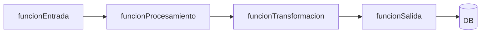

# Manual del Developer — SdDd

> Guía completa del marco Spec-Driven Development documentation (SdDd).
> Este documento es para lectura humana — el developer lo lee, no la IA.
> Versión: 1.0 | Fecha: 20260408

---

## ¿Qué es SdDd?

SdDd es un marco de documentación para desarrollo dirigido por especificaciones (Spec-Driven Development). Hace que el trabajo con agentes de IA sea predecible, trazable y de calidad profesional, sin generar burocracia innecesaria.

**El problema que resuelve:** el "vibe-coding" — dar instrucciones vagas a un agente de IA — produce resultados inconsistentes, alucinaciones técnicas y código difícil de mantener. SdDd introduce contratos explícitos entre el developer, los agentes y el código.

**Lo que NO es:** SdDd no es un generador de código ni un framework de programación. Es un sistema de documentación que estructura el proceso de trabajo con IA.

---

## Instalación desde bootstrap

El único archivo necesario para instalar SdDd en cualquier proyecto es `sdddBootstrap.md`.
Contiene el sistema completo comprimido — 27 archivos en ~41 KB.

**Paso 1 — Copia el bootstrap a la raíz del proyecto destino**

```bash
cp /ruta/SdDd/workshop/instalador/sdddBootstrap.md /ruta/tuProyecto/
```

**Paso 2 — Abre Claude Code en el proyecto destino**

```bash
cd /ruta/tuProyecto
claude
```

**Paso 3 — Pide a la IA que ejecute el bootstrap**

Di literalmente:

> "Lee el archivo `sdddBootstrap.md` y ejecuta su protocolo de extracción completo."

La IA creará `sddd/` con templates, agentes, skills y el manual. Reportará cada archivo extraído.

**Paso 4 — Elige tu flujo de inicio**

| Situación | Instrucción a la IA |
|:---|:---|
| Proyecto nuevo, sin código todavía | "Lee `.agent/skills/sddd/SKILL.md` y ejecuta el flujo de inicialización." |
| Proyecto existente, ya tiene código | "Lee `.agent/skills/sddd/SKILL.md` y ejecuta el modo retro." |

**Sobre el archivo bootstrap**

El bloque comprimido dentro de `sdddBootstrap.md` es gzip+base64: los 27 archivos del sistema
convertidos a texto puro para que puedan vivir dentro de un `.md`. Python lo decodifica en
memoria — no requiere herramientas externas ni instalaciones adicionales.

Para actualizar el sistema SdDd en un proyecto que ya lo tiene instalado, vuelve a ejecutar
el bootstrap y elige "actualizar" cuando pregunte si `sddd/` ya existe.

---

## Los tres scopes

### MACRO — Proyecto completo multi-fase

Para proyectos grandes: múltiples módulos, fases de desarrollo, equipos de agentes, semanas o meses de trabajo.

**Cuándo usar:** el proyecto tiene más de 3 features interdependientes, requiere planificación por fases, o necesita coordinación entre múltiples agentes en paralelo.

**Documentos obligatorios:** todos los de `core/` + `roadmap.md` + `fase[N].md` por cada fase + ciclo MESO completo por cada feature/epic.

---

### MESO — Feature, módulo o expansión

El nivel de trabajo más frecuente. Una funcionalidad nueva, un módulo, una expansión significativa del sistema.

**Cuándo usar:** el trabajo tiene más de 4 tasks, toca más de un módulo, o tiene criterios de aceptación que deben verificarse formalmente.

**Documentos obligatorios:** `propuesta.md`, `spec.md`, `tasks.md`
**Opcionales según complejidad:** `planAgentes.md`, `verificacion.md`

---

### MICRO — Fix, debug o pieza funcional pequeña

Para trabajo acotado: un bug, un ajuste de configuración, una función utilitaria, un componente aislado, un script de procesamiento puntual.

**Cuándo usar:** el trabajo tiene propósito concreto y alcance limitado — no toca más de un módulo, no requiere cambios de arquitectura.

**Un solo documento:** `micro[NombreDelTrabajo].md`

---

## ¿Cómo decidir qué scope aplica?

```
¿Hay más de 3 features interdependientes?
  → SÍ: MACRO
  → NO: ↓

¿El trabajo toca más de un módulo o tiene más de 4 tasks?
  → SÍ: MESO
  → NO: ↓

¿Es un fix, ajuste o pieza funcional pequeña y autónoma?
  → SÍ: MICRO
```

**Señal de escalado:** si durante un MICRO aparecen dependencias no previstas, efectos en otros módulos, o la lista de tasks supera 8 items → escalar a MESO creando el ciclo completo.

---

## Estructura de carpetas en tu proyecto

Al aplicar SdDd a un proyecto, crea esta estructura en la raíz:

```
tuProyecto/
│
├── .agent/
│   ├── agents/                         ← 6 sub-agentes especializados
│   │   ├── agSemantico.md
│   │   ├── agEncuesta.md
│   │   ├── agDocumentacion.md
│   │   ├── agArquitectura.md
│   │   ├── agTasks.md
│   │   └── agVerificacion.md
│   └── skills/
│       └── sddd/                       ← meta-skill SdDd (carpeta canónica)
│           ├── SKILL.md                ← orquestador — punto de entrada único
│           └── sub/                    ← sub-skills invocadas por el orquestador
│               ├── sdddInit.md
│               ├── sdddWork.md
│               └── sdddRetro.md
│
└── sddd/
    ├── manualDeveloper.md
    │
    ├── core/
    │   ├── constitucion.md
    │   ├── contextoProducto.md
    │   ├── arquitectura.md
    │   ├── stackDependencias.md
    │   ├── inventarioCodigo.md
    │   └── gitMap.md
    │
    ├── macro/
    │   ├── roadmap.md
    │   └── fases/
    │       ├── fase01[NombreFase].md
    │       └── fase02[NombreFase].md
    │
    ├── features/
    │   ├── activos/
    │   │   └── [nombreFeature]/
    │   │       ├── propuesta.md
    │   │       ├── spec.md
    │   │       ├── planAgentes.md
    │   │       ├── tasks.md
    │   │       ├── verificacion.md
    │   │       └── encuesta.md
    │   └── archivo/
    │       └── 20260408[nombreFeature]/
    │
    ├── micro/
    │   ├── activos/
    │   │   └── micro[NombreFix].md
    │   └── archivo/
    │       └── 20260408micro[NombreFix].md
    │
    ├── retro/
    │   ├── diagnosticoSddd.md
    │   └── planConstruccion.md
    │
    └── _templates/
        ├── core/
        ├── macro/
        ├── features/
        ├── micro/
        └── retro/
```

**Reglas de nomenclatura:**
- Todo en camelCase — archivos, carpetas, nombres de features y micros
- Prefijos de fecha `YYYYMMDD` solo en carpetas de `archivo/` al momento de archivar
- Templates siempre con prefijo `tpl` — nunca editarlos directamente; copiarlos

**Nota sobre la meta-skill:**
`.agent/skills/sddd/SKILL.md` es el orquestador único — el punto de entrada para todo el trabajo SdDd.
Los archivos en `sub/` son sub-skills internas invocadas por el orquestador; el developer no las
invoca directamente salvo en contextos avanzados. Todos los archivos tienen frontmatter YAML con
`name` y `description` semántico que habilita el Progressive Disclosure del sistema SSoT.

---

## Cómo empezar un proyecto nuevo con SdDd

### Paso 1 — Invocar al Orquestador

Di: `"Quiero iniciar SdDd para el proyecto [nombre]. Scope: MACRO / MESO / MICRO."`

El Orquestador activa el Agente de Encuesta para la entrevista de Capa 0.

### Paso 2 — Completar core/ (Capa 0)

El Agente de Encuesta hace preguntas sobre stack, restricciones, visión y arquitectura. Responde con el nivel de detalle que tienes ahora; los documentos son vivos y evolucionan. Al terminar, el Agente de Documentación genera los borradores y tú apruebas.

**Orden de creación dentro de core/:**
1. `constitucion.md` — primero siempre; los demás lo necesitan como referencia
2. `contextoProducto.md`
3. `arquitectura.md`
4. `stackDependencias.md`
5. `inventarioCodigo.md` — puede quedar vacío al inicio; se completa con cada feature

### Paso 3 — Para MACRO: definir el roadmap

Tras aprobar `core/`, el Orquestador pregunta por fases, epics y dependencias. Genera `roadmap.md` y los `fase[N].md`.

### Paso 4 — Ciclo de trabajo MESO (repetible por feature)

```
1. "Quiero trabajar en el feature [nombre]"
2. Agente de Encuesta → encuesta MESO (8 preguntas con ejemplos)
3. Ag. Documentación → propuesta.md borrador → tú apruebas
4. Ag. Documentación → spec.md borrador → tú apruebas
5. Ag. Tasks → tasks.md (+ Ag. Arquitectura → planAgentes.md si aplica)
6. Implementación según tasks.md
7. Ag. Verificación → revisión dual → tú apruebas cierre
8. Aplicar delta a core/ → archivar feature
```

### Paso 5 — Ciclo MICRO (repetible)

```
1. "Necesito un micro para [descripción breve]"
2. Agente de Encuesta → 4 preguntas rápidas
3. Orquestador → genera micro[Nombre].md
4. Implementación
5. Notas post-implementación → archivar
```

---

## Cómo aplicar SdDd a un proyecto existente — Modo Retro

Si el proyecto ya existe y no tiene SdDd:

```
1. "Quiero aplicar SdDd al proyecto existente en [ruta]"
2. Ag. Semántico → barrido del código y docs existentes
3. Orquestador → genera diagnosticoSddd.md → tú apruebas
4. Orquestador → genera planConstruccion.md con orden de construcción
5. Encuestas focalizadas solo para los gaps no recuperables del código
6. Construcción de documentos en el orden del plan
```

El Modo Retro no reinventa el proyecto — documenta lo que ya existe y llena los gaps con información que solo el developer tiene.

---

## El ciclo de vida de un feature MESO

```
propuesta.md
    ↓ (encuesta MESO)
spec.md  ←──── (puede evolucionar por requerimientos dinámicos)
    ↓
planAgentes.md (si hay multiagéntica)
    ↓
tasks.md
    ↓
implementación
    ↓
verificacion.md (revisión dual)
    ↓
delta aplicado a core/
    ↓
archivo/20260408[nombreFeature]/
```

---

## Los documentos — tabla de referencia rápida

| Documento | Scope | Para qué sirve | Quién lo usa más |
|:---|:---|:---|:---|
| `constitucion.md` | core | Reglas no negociables del proyecto | IA antes de proponer cualquier cosa |
| `contextoProducto.md` | core | Qué es el producto y por qué existe | IA para alinear soluciones con visión |
| `arquitectura.md` | core | Decisiones estructurales ya tomadas | IA para no contradecir la arquitectura |
| `stackDependencias.md` | core | Librerías aprobadas / evaluación / descartadas | IA al proponer dependencias |
| `inventarioCodigo.md` | core | Mapa de módulos, funciones y scripts | IA para localizar código |
| `roadmap.md` | MACRO | Fases y secuencia del proyecto | Developer + Orquestador |
| `fase[N].md` | MACRO | Scope de cada fase | Orquestador al iniciar una fase |
| `propuesta.md` | MESO | Intención del feature (sin técnica) | Developer para validar entendimiento |
| `spec.md` | MESO | Contrato de comportamiento del feature | Todo el sistema — fuente de verdad |
| `planAgentes.md` | MESO | Orquestación multi-agente | Orquestador para coordinar agentes |
| `tasks.md` | MESO | Lista ejecutable de tareas | Developer + agentes durante implementación |
| `verificacion.md` | MESO | Revisión dual antes de cerrar | Ag. Verificación + developer |
| `micro[Nombre].md` | MICRO | Todo el ciclo micro en un documento | Developer + Orquestador |
| `encuesta.md` | MESO | Registro de la entrevista conducida | Trazabilidad del proceso |
| `diagnosticoSddd.md` | retro | Estado del proyecto antes de aplicar SdDd | Solo en Modo Retro |
| `planConstruccion.md` | retro | Orden para construir el SdDd retro | Solo en Modo Retro |
| `gitMap.md` | core | Fuente de verdad de routing de artefactos a repositorios | Developer + agente al hacer push |

---

## Los agentes del sistema

Tú solo hablas con el **Orquestador SdDd**. Los demás son internos al sistema.

| Agente | Qué hace | Por qué es eficiente |
|:---|:---|:---|
| **Orquestador SdDd** | Coordina el flujo completo. Tu único interlocutor. | Traduce intención en acciones concretas sin que el developer decida qué agente usar |
| **Ag. de Encuesta** | Conduce entrevistas con ejemplos antes de crear documentos | Genera documentos desde respuestas — el developer revisa en lugar de crear desde cero |
| **Ag. Semántico** | Lee código y docs, extrae conocimiento comprimido | Transfiere solo el mapa semántico al siguiente agente — no el código completo |
| **Ag. de Documentación** | Redacta documentos SdDd desde inputs estructurados | Consistencia garantizada — siempre en el formato del marco |
| **Ag. de Arquitectura** | Genera Mermaid, propone dependencias, valida coherencia | Las propuestas siempre respetan `constitucion.md` y `arquitectura.md` |
| **Ag. de Tasks** | Desglosa specs en tasks con asignaciones y criterios | El developer revisa un plan — no construye la lista desde cero |
| **Ag. de Verificación** | Revisión dual independiente al final | Detecta divergencias entre lo prometido en spec y lo implementado |

**Por qué gana tokens:** cada sub-agente recibe solo el contexto mínimo que necesita. El Agente Semántico no recibe el historial de conversación. El Agente de Tasks no recibe el código fuente completo. Los **contratos de fase** definen exactamente qué se transfiere entre agentes.

---

## El sistema de requerimientos dinámicos

Los requerimientos en `spec.md` tienen estado y versión — pueden cambiar sin perder la historia:

| Estado | Significado |
|:---|:---|
| `borrador` | Propuesto pero no confirmado — puede cambiar |
| `confirmado` | Aprobado por el developer — es contrato |
| `modificado` | Cambió respecto a la versión anterior — con registro del cambio |
| `descartado` | Ya no aplica — se registra por qué, no se borra |

Al modificar un RD: incrementar la versión y registrar qué cambió y por qué.

---

## El sistema de deltas

Al archivar un feature completado, `verificacion.md` lista los cambios que deben aplicarse a `core/`:

- Nuevas decisiones de arquitectura → `arquitectura.md`
- Dependencias confirmadas → `stackDependencias.md`
- Funciones, módulos o scripts nuevos → `inventarioCodigo.md`
- Nuevas reglas que emergieron → `constitucion.md`

Los documentos de `core/` son la fuente de verdad permanente. Los features los actualizan; nunca los contradicen.

---

## Los ciclos de trabajo

SdDd define dos ciclos operativos que estructuran cómo el developer interactúa con el agente
en cada sesión. Ambos tienen la misma anatomía: una fase de exploración (ronda conceptual)
y una fase de ejecución (push al cerrar).

### Ciclo Develop — trabajo nuevo

Para features MESO o piezas funcionales que aún no existen.

| Fase | Instrucción | Estado de sesión |
|:---|:---|:---|
| `idea` | `"idea: [descripción breve]"` | Ronda conceptual — solo chat |
| `develop+[variante]` | `"develop+docu"` / `"develop+gee"` / etc. | Ejecuta + documenta + push |

**Apertura:** el developer escribe `idea: [descripción]`. El agente entra en ronda conceptual.
**Cierre:** el developer escribe `develop+[variante]`. El agente ejecuta, documenta y hace push.

### Ciclo Fix — corrección de comportamiento existente

Para bugs, regresiones o ajustes en funcionalidad ya existente.

| Fase | Instrucción | Estado de sesión |
|:---|:---|:---|
| `feedback` | `"feedback: [descripción del problema]"` | Ronda conceptual — solo chat |
| `fix+[variante]` | `"fix+docu"` / `"fix+gee"` / etc. | Ejecuta + documenta + push |

**Apertura:** el developer escribe `feedback: [descripción]`. El agente entra en ronda conceptual.
**Cierre:** el developer escribe `fix+[variante]`. El agente ejecuta, documenta y hace push.

### Variantes de push

| Variante | Destino | Condición |
|:---|:---|:---|
| `+docu` | GitHub origin | Proyectos de documentación / sin GEE ni GAS |
| `+gee` | GEE remote | Proyecto con código GeE en repositorio GEE |
| `+gas` | Google Apps Script | Proyecto con scripts GAS |
| `+docu+gee` | GitHub + GEE | Proyecto mixto |
| `+docu+gas` | GitHub + GAS | Proyecto mixto |
| `+gee+gas` | GEE + GAS | Sin repositorio GitHub |

### Regla dinámica — ciclos concurrentes

Cuando hay un ciclo activo y se solicita iniciar otro:

1. El agente pregunta: **"¿Cerrar el ciclo actual o pausarlo?"**
2. **Cerrar:** registra cierre con firma `[cerrado por analista | YYYYMMDD]`
3. **Pausar:** registra evento de pausa en el documento activo; el nuevo ciclo inicia
4. **Fin de sesión:** todo ciclo abierto se pausa automáticamente con timestamp
5. **Inicio de sesión siguiente:** el agente muestra recordatorio de ciclos pausados

**Cierre implícito:** si la resolución es evidente, el agente pregunta "¿Cerramos el ciclo?"
— no espera instrucción explícita del developer.

---

## El gitMap

`gitMap.md` vive en `sddd/core/`. Es la fuente de verdad sobre qué artefacto sube a
qué repositorio. Se consulta antes de cada push; se actualiza al agregar, mover o eliminar archivos.

**Estructura:**

1. **Sección 1 — Mapa Extensivo:** árbol completo del proyecto con etiqueta por archivo o carpeta
2. **Sección 2 — Mapa Resumido:** carpetas ignoradas colapsadas + lo que sube expandido
3. **Sección 3 — Arquitectura de repos** (si hay múltiples destinos): rol de cada remote y protocolo

**Etiquetas estándar:**
- `[Subir A Github]` — sube al repositorio GitHub principal
- `[Ignorar En Github]` — local only, no se versiona
- `[Subir A Gee]` — se despliega al repositorio GEE via push-gee
- `[Subir A Github Público]` — también va al repo público (cuando hay dual-push)

---

## El inventario de código y los grafos Mermaid

`inventarioCodigo.md` tiene dos partes complementarias:

**1. Tabla de inventario:** qué función existe, en qué archivo, qué hace, qué consume y quién la consume.

**2. Grafo de dependencias funcionales:** conexiones entre funciones a lo largo de los downstreams.



**Política:** un grafo por módulo o por flujo downstream crítico — no un grafo de todo el proyecto (ilegible a partir de 15 nodos). Se actualiza al completar cada feature o micro que modifique el código.

---

## Glosario

| Término | Definición |
|:---|:---|
| **Spec** | Contrato de comportamiento de un feature. Define qué; no el cómo. |
| **Constraint** | Restricción explícita: qué NO debe hacer el feature o el sistema. |
| **Delta** | Cambio incremental aplicado a un documento de `core/` al archivar un feature. |
| **Taskification** | Proceso de descomponer una spec en tareas granulares ejecutables. |
| **Revisión dual** | Dos preguntas independientes al cerrar: ¿cumple la spec? + ¿está bien construido? |
| **Human-in-the-loop** | Puntos del flujo donde el developer valida antes de continuar. |
| **Modo Retro** | Sub-flujo para aplicar SdDd a un proyecto que ya existe. |
| **Contrato de fase** | Definición de qué entrega un agente al siguiente: input/output, formato, validación. |
| **Requerimiento dinámico (RD)** | Requisito funcional con estado y versión; puede evolucionar documentando el cambio. |
| **Barrido semántico** | Lectura del código y docs por el Ag. Semántico para extraer conocimiento estructurado. |
| **Pieza funcional** | Tipo de MICRO: unidad de código con propósito concreto y alcance limitado. |
| **Escalar** | Decidir que un trabajo MICRO es en realidad MESO — cuando supera los límites definidos. |
| **Ciclo Develop** | Ciclo para trabajo nuevo: `idea` (ronda conceptual) → `develop+[variante]` (ejecuta + push). |
| **Ciclo Fix** | Ciclo para corregir comportamiento existente: `feedback` (ronda conceptual) → `fix+[variante]` (ejecuta + push). |
| **Regla dinámica** | Protocolo de gestión cuando dos ciclos se solapan en la misma sesión: el agente pregunta cerrar o pausar. |
| **gitMap** | Documento declarativo en `sddd/core/` que anota cada artefacto con su destino de repositorio. |
| **Variante de push** | Sufijo que indica el destino de push al cerrar un ciclo: `+docu`, `+gee`, `+gas` o combinaciones. |
